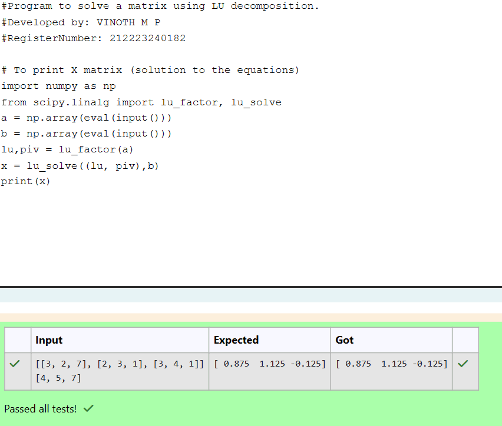

# LU Decomposition 

## AIM:
To write a program to find the LU Decomposition of a matrix.

## Equipments Required:
1. Hardware – PCs
2. Anaconda – Python 3.7 Installation / Moodle-Code Runner

## Algorithm
1. import numpy as np 
2. import lu from scipy.linalg
3. get input from user using eval function and store it in a variable
4. print L and U martix 
5. to solve import lu_factor and lu_solve
6. and print the solved matrix

## Program:
(i) To find the L and U matrix
```
#Program to find L and U matrix using LU decomposition.
#Developed by: VINOTH M P
#RegisterNumber: 212223240182

import numpy as np
from scipy.linalg import lu
a = np.array(eval(input()))
p,l,u = lu(a)
print(l)
print(u)
```
(ii) To find the LU Decomposition of a matrix
```
#Program to solve a matrix using LU decomposition.
#Developed by: VINOTH M P 
#RegisterNumber: 212223240182

# To print X matrix (solution to the equations)
import numpy as np
from scipy.linalg import lu_factor, lu_solve
a = np.array(eval(input()))
b = np.array(eval(input()))
lu,piv = lu_factor(a)
x = lu_solve((lu, piv),b)
print(x)
```

## Output:



## Result:
Thus the program to find the LU Decomposition of a matrix is written and verified using python programming.

